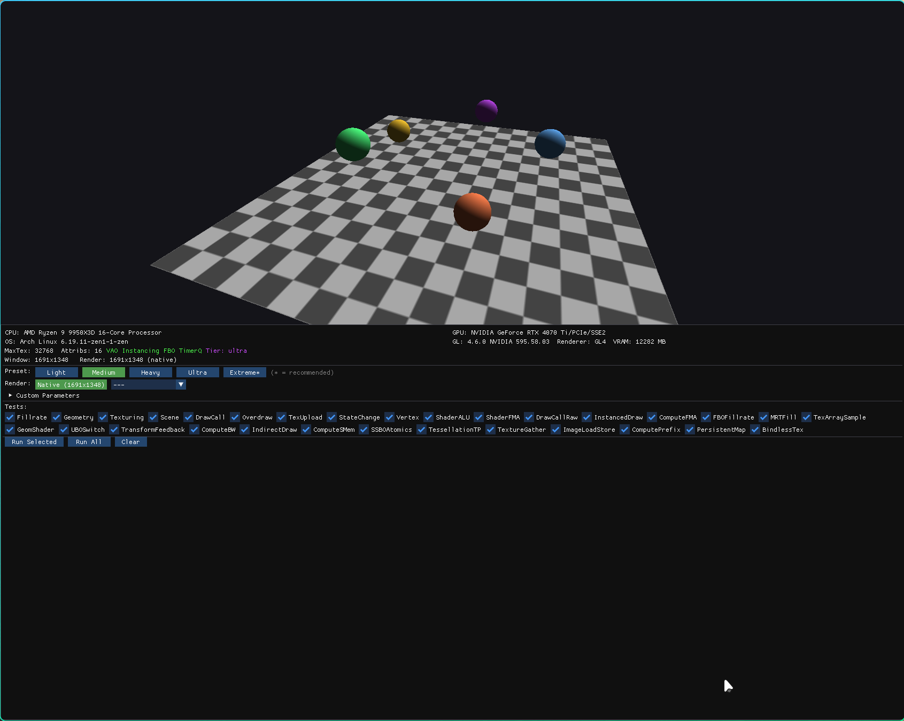
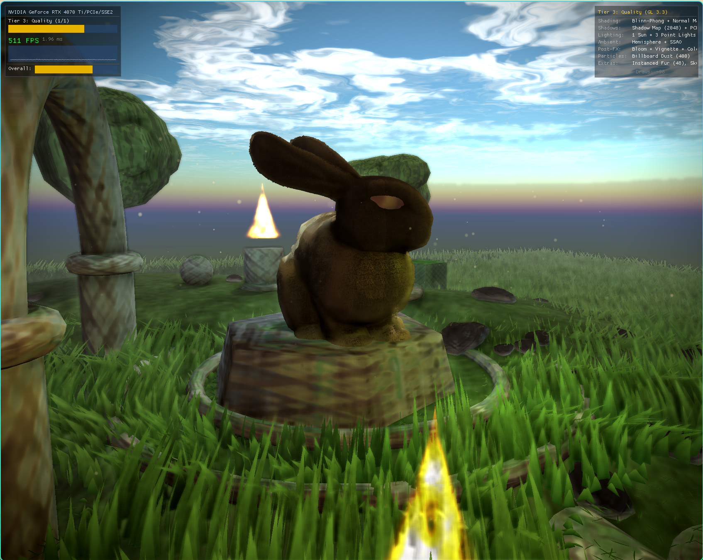
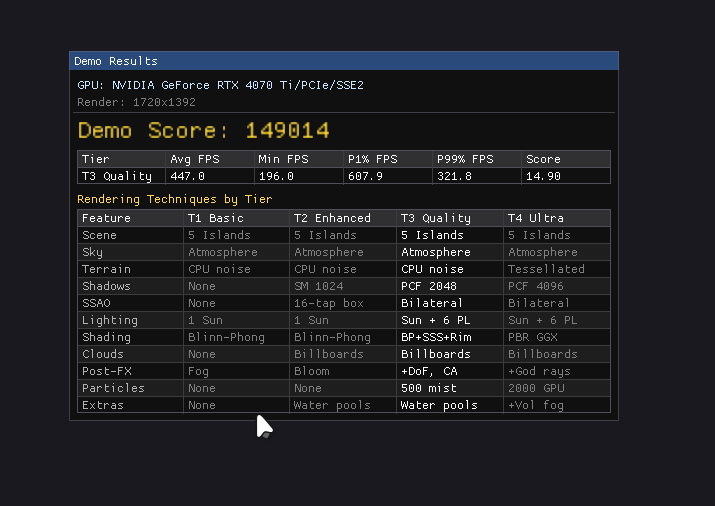

# GPU Benchmark

[](https://github.com/At1ass/GPU_bench/actions/workflows/build.yml)
[](LICENSE)
[]()
[]()

Cross-platform OpenGL benchmark for comparing GPU performance across hardware generations. Targets wide compatibility: from old integrated GPUs (GeForce 6000+ / Radeon HD 2000+) to modern discrete cards, on systems from Windows XP to current releases. Includes a 3DMark-style visual demo with progressive rendering tiers.



## Highlights

- **30 GPU tests** — fill rate, geometry, texturing, compute, draw call overhead, state switching, and more
- **4 renderer backends** — GL2 (OpenGL 2.0), GL3 (3.0+), GL4 (4.3+), GLES (3.0) with automatic fallback
- **Visual demo** — "Forgotten Sanctuary" scene with 4 quality tiers (Blinn-Phong to PBR + compute)
- **6 platforms** — Linux, Windows (MSVC + MinGW), macOS, FreeBSD, Android (ARM64 + ARMv7)
- **87 unit tests** in 16 test suites via doctest



## Quick Start

```bash
# Build
git clone --recursive https://github.com/At1ass/GPU_bench.git
cd GPU_bench
./scripts/build.sh native

# Download Stanford Bunny model (required for demo)
./scripts/fetch_bunny.sh

# Run benchmark (interactive GUI)
./build_native/gpu_benchmark

# Run visual demo
./build_native/gpu_demo

# Run tests
./build_native/gpubench_tests
```

## Build Targets

| Target | Command | Output |
|--------|---------|--------|
| Linux / macOS / FreeBSD | `./scripts/build.sh native` | `build_native/` |
| Windows 64-bit (cross) | `./scripts/build.sh mingw64` | `build_mingw64/` |
| Windows 32-bit (cross) | `./scripts/build.sh mingw32` | `build_mingw32/` |
| Portable (static SDL2) | `./scripts/build.sh portable` | `build_portable/` |
| Android APK | `./scripts/build.sh android` | `android/app/build/outputs/apk/` |
| Debug + sanitizers | `./scripts/build.sh sanitize` | `build_sanitize/` |

### Requirements

- CMake 3.0+, C++11 compiler (GCC 4.8+, Clang 3.3+, MSVC 2015+)
- SDL2 development libraries, OpenGL development libraries
- Android: Android SDK + NDK (Gradle downloads NDK automatically)

For detailed build instructions see [docs/building.md](docs/building.md).

## Tests

### GL2 Universal (12 tests)

| Test | Unit | What it measures |
|------|------|------------------|
| Fillrate | MPix/s | Pixel fill throughput (opaque quads) |
| Geometry | Mtri/s | Triangle throughput (dense grids) |
| Texturing | MTex/s | Texture sampling rate |
| Scene | FPS | Combined rendering workload |
| DrawCall | calls/s | Draw call overhead with uniforms |
| DrawCallRaw | calls/s | Raw driver submission |
| Overdraw | MPix/s | Alpha blend throughput |
| TexUpload | MB/s | CPU to GPU texture upload |
| StateChange | ops/s | Pipeline state switching cost |
| Vertex | Mverts/s | Vertex processing rate |
| ShaderALU | GFLOP/s | Fragment shader ALU (sin/cos/pow) |
| ShaderFMA | GFLOP/s | Fragment shader FMA throughput |

### GL3+ (7 tests) and GL4+ (11 tests)

GL3: instancing, FBO fillrate, MRT, texture arrays, geometry shaders, UBO, transform feedback.
GL4: compute FMA/bandwidth/shared memory, SSBO atomics, indirect draw, tessellation, texture gather, image load/store, persistent mapping, bindless textures.

Tests requiring unsupported features are automatically disabled. See [docs/tests.md](docs/tests.md) for full descriptions.

## Demo Mode

3DMark-style visual benchmark with the "Forgotten Sanctuary" scene.

| Tier | GL Required | Rendering |
|------|-------------|-----------|
| Basic | GL 2.1 | Blinn-Phong, shell fur, fog |
| Enhanced | GL 3.0+ | + shadows (1024), SSAO, bloom, instanced grass |
| Quality | GL 3.3+ | + PCF (2048), point lights, normal maps, DoF |
| Ultra | GL 4.3+ | + PBR, PCSS (4096), compute particles, GTAO, tessellation, volumetric fog, SSR |



```bash
./gpu_demo                          # Auto-detect tiers
./gpu_demo --tier 3                 # Specific tier
./gpu_demo --headless --output json # Headless with JSON export
```

## Usage

```bash
# Benchmark
./gpu_benchmark                                    # Interactive GUI
./gpu_benchmark --headless --test all              # All tests, text output
./gpu_benchmark --preset ultra --output json -o results.json
./gpu_benchmark --stress 300                       # Stress test 5 min
./gpu_benchmark --list-gpus                        # Show available GPUs
./gpu_benchmark --gpu 1                            # Select GPU by index

# Demo
./gpu_demo --tier 4 --duration 30 --debug=verbose
```

See [docs/usage.md](docs/usage.md) for all options.

## Results and Scoring

- Per-test: score in native units, timing (avg/min/max/P1/P99/median), CV%
- Composite: geometric mean by category (Fill, Geometry, Compute, Overhead)
- Bottleneck analysis identifies the weakest GPU subsystem

See [docs/results.md](docs/results.md) for details.

## Project Structure

```
src/
  core/                          App config, polling interface
  renderer/                      Abstract renderer interface + factory
    backend/                     GL2/GL3/GL4/GLES implementations
      gl/                        GL loader, extensions, debug, timer
    context/                     SDL window + GL/GLES context
  engine/                        Pass framework, state, draw list, uniforms
  bench/                         Benchmark runner, presets, results, UI
  tests/                         30 benchmark test implementations
  demo/                          Visual demo entry point, runner, UI, export
    scene/                       Scene, camera, resources, materials
    tier/                        Tier config, shader cache, feature flags
    pipeline/                    Pipeline builder, pass factory, pass registry
    passes/                      24 render pass implementations
  geometry/                      Math types, mesh generation, OBJ loader
  platform/                      Logger, timer, data path, hardware detection
    posix/                       Linux/FreeBSD implementations
    win32/                       Windows implementations
    android/                     Android implementations
    darwin/                      macOS implementations
  launcher/                      Desktop launcher GUI (separate binary)
android/                         Gradle project for Android APK
data/
  shaders/                       GLSL shaders (with #pragma include support)
  models/                        Stanford Bunny OBJ
  scenes/                        Data-driven scene files
tests/                           Unit tests (doctest, 87 cases in 16 suites)
```

## Architecture

- **Renderer hierarchy**: `Renderer` (abstract) -> GL2 -> GL3 -> GL4, plus GLES. Feature interfaces (`GL3Features`, `GL4Features`, `ComputeFeatures`) via LLVM-style `features<T>()` dispatch.
- **Pass templates**: `FullscreenPass`, `GeometryPass`, `ComputePassBase` — implement 2-3 methods to create a new render pass. See [docs/adding_render_pass.md](docs/adding_render_pass.md).
- **Test registry**: X-macro (`test_registry.def`) — one line per test, generates enum + metadata + factory.
- **Pass registry**: X-macro (`pass_registry.def`) — one line per render pass.
- **Type-safe handles**: `Handle<Tag>` wrappers prevent cross-type confusion. RAII via `ScopedHandle<H>`.
- **State cache**: eliminates ~50% redundant GL calls.

## Extending

- **[Adding a render pass](docs/adding_render_pass.md)** — step-by-step with fullscreen, geometry, and compute examples
- **[Adding a benchmark test](docs/adding-tests.md)** — one line in `test_registry.def` + implement the class
- **[Custom config presets](docs/config.md)** — INI file format reference

## Compatibility

**Minimum GPU**: OpenGL 2.0 (GeForce 6000+, Radeon HD 2000+, Intel GMA 950+)

| Platform | Status | Notes |
|----------|--------|-------|
| Linux x86_64 | CI (GCC + Clang) | Primary development platform |
| Linux ARM64 | Tested | Fedora Asahi on MacBook Air M1 |
| Windows x64 | CI (MSVC + MinGW) | Native and cross-compiled |
| Windows x86 | CI (MinGW cross) | Windows XP compatible |
| macOS ARM64 | CI (Clang) | Via Metal-backed GL |
| FreeBSD | CI (VM) | Mesa drivers |
| Android ARM64/ARMv7 | CI (NDK) | GLES 3.0, two Activities in one APK |

## Documentation

| Document | Description |
|----------|-------------|
| [Building](docs/building.md) | Detailed build instructions for all platforms |
| [Usage](docs/usage.md) | CLI options, examples, GPU selection |
| [Tests](docs/tests.md) | Test descriptions, scoring formulas, parameters |
| [Results](docs/results.md) | Interpreting scores and statistics |
| [Config](docs/config.md) | Custom preset INI format |
| [Adding Tests](docs/adding-tests.md) | How to add new benchmark tests |
| [Adding Render Passes](docs/adding_render_pass.md) | How to add new demo render passes |
| [Engine Design](docs/engine_layer_design.md) | Engine layer architecture |
| [Testing Plan](docs/testing_plan.md) | Test coverage roadmap |
| [Audit Report](docs/audit_report.md) | Code quality audit with issue tracking |

## License

[Apache License 2.0](LICENSE)

Copyright 2026 Nikolay Kuznetsov
